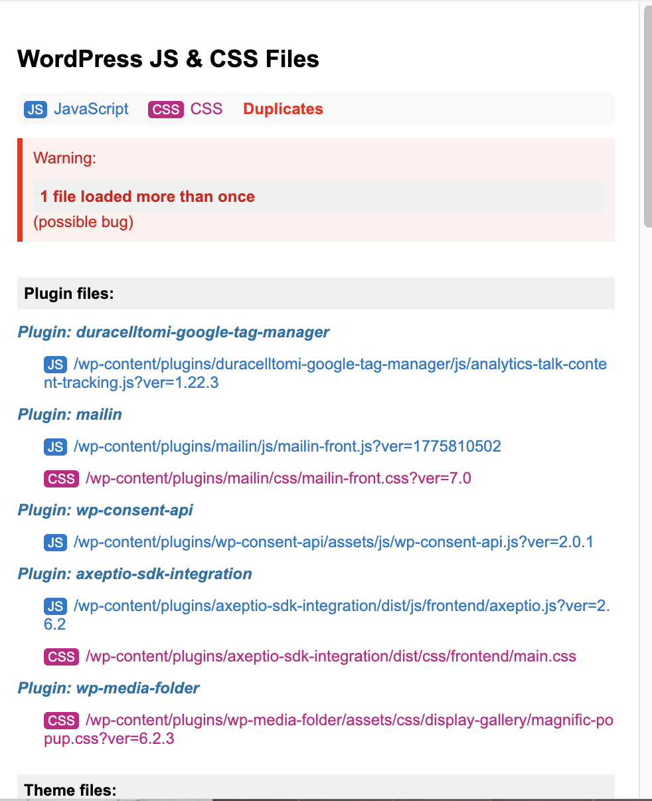
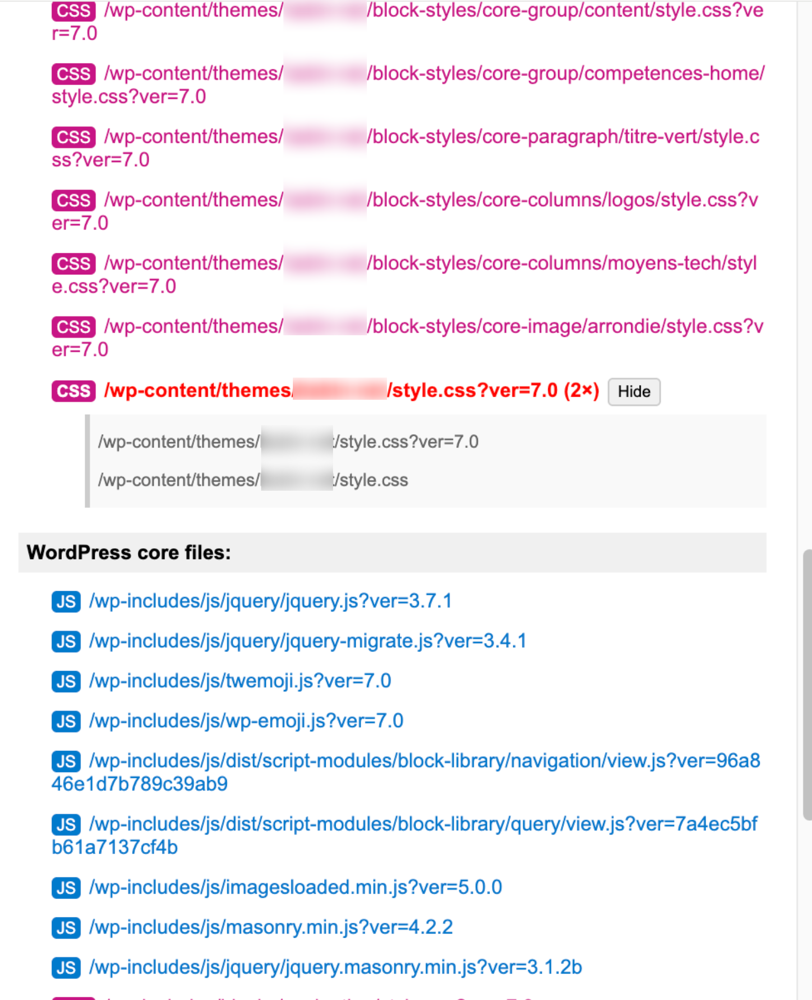

# WordPress Files Analyzer

<p align="center">
  
</p>

Chrome extension to list the JavaScript and CSS files loaded on the current WordPress page.

It groups assets by source so you can quickly spot files coming from plugins, the active theme, WordPress core, or external sources. It also highlights duplicated files when the same asset is loaded more than once with different query strings.

## Why

When debugging a WordPress site, it is often useful to answer simple questions quickly:

- Which plugin loads this script?
- Which CSS files come from the theme?
- Are some assets loaded twice?
- Is a file coming from WordPress core, a plugin, the theme, or somewhere else?

This extension is meant for quick inspection during development, maintenance, and technical audits. It is not a full performance audit tool.

## Features

- Lists scripts loaded with `script[src]`.
- Lists stylesheets loaded with `link rel="stylesheet"`.
- Groups files into:
  - plugins;
  - theme;
  - WordPress core;
  - other sources.
- Extracts plugin folder names from `/wp-content/plugins/...` URLs.
- Detects duplicated assets by comparing URLs without query strings.
- Shows all loaded variants when a duplicate is found.

## Installation

1. Download or clone this repository.
2. Open Chrome and go to `chrome://extensions/`.
3. Enable **Developer mode**.
4. Click **Load unpacked**.
5. Select the extension folder.

## Usage

1. Open a WordPress page.
2. Click the extension icon.
3. Review the grouped JS and CSS files.
4. If duplicates are shown, click **Details** to see the loaded variants.

## Screenshots

### Popup Overview



### Duplicate Details



## Permissions

The extension uses:

- `activeTab`: to inspect the currently active tab when the popup is opened;
- `scripting`: to run the asset collection function on the current page;
- `<all_urls>` host permission: to allow inspection on any website you explicitly open.

The extension does not send collected data to a remote server.

## Limits

- It only detects files present in the DOM at the time the popup runs.
- It does not measure file size, load time, cache status, or execution cost.
- It does not detect assets loaded later by JavaScript after the scan.
- It uses WordPress URL patterns such as `/wp-content/plugins/`, `/wp-content/themes/`, `/wp-includes/`, and `/wp-admin/`.
- It may classify heavily customized WordPress setups as `other`.

## Development Notes

The main logic is in `popup.js`.

The collector runs in the current tab and returns grouped assets to the popup UI. Duplicate detection normalizes URLs by removing query strings, so these two URLs are treated as the same file:

```text
https://example.com/wp-content/plugins/example/app.js?ver=1.0.0
https://example.com/wp-content/plugins/example/app.js?ver=1.0.1
```

## Roadmap Ideas

- Add a copy/export button.
- Add filters by asset type or source.
- Show totals per category.
- Detect common third-party services.
- Add optional JSON export for audits.

## License

MIT License. See [LICENSE](LICENSE).
